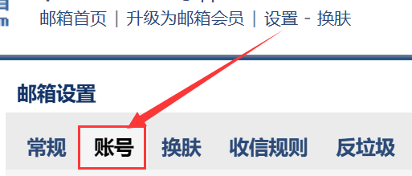
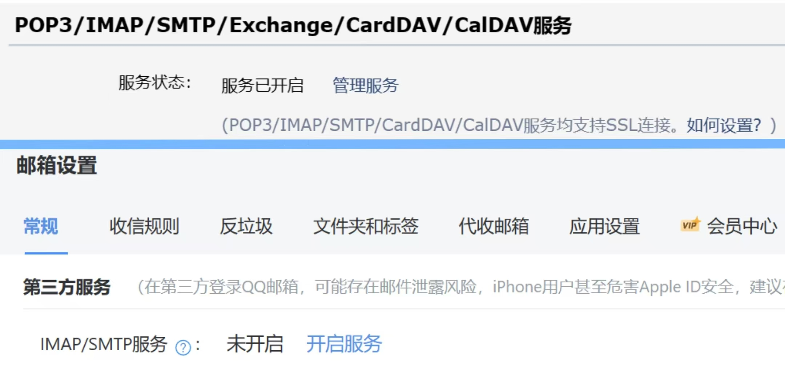
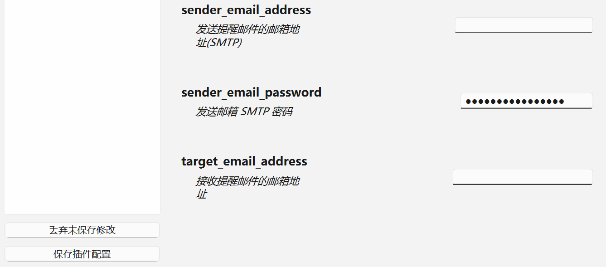

# 华师大校园小插件

<div align="center">
  <h1><a href="https://github.com/azazo1/ecnu-campus-plugins"></a></h1>

华师大校园小插件旨在利用校园内已提供的服务为学生提供一个更自动化, 人性化的便利服务.

[](https://github.com/azazo1/ecnu-campus-plugins)
[](https://github.com/azazo1/ecnu-campus-plugins/graphs/contributors)
[](https://github.com/azazo1/ecnu-campus-plugins/blob/master/LICENSE)
</div>

[//]: # (todo 将仓库状态变为 Public, 添加./github/workflows/python-cli.yml)

## 功能简介

本项目实现了以下功能:

- ✅ 一键生成当周课表、课前邮件提醒
- ✅ 课后研修间与图书馆的全自动预约
- ✅ 宿舍电费自动查询及充值提醒
- ✅ 适配 ECNU 多种系统的登录缓存，实现了插件框架，能够接收更多开发者的贡献与集成

## 部署方法

本项目的核心依赖于 Webdriver 与邮箱的 SMTP 协议, 二者为必须的配置项. 您可以通过自身所需配置更多模块.

### 基础配置

#### 环境准备

进入项目目录, 运行:

```shell
pip install -r requirements.txt
```

#### 邮箱配置

使用一个支持 SMTP 协议的邮箱进行配置 (主流邮件服务均支持), 以下为 QQ 邮箱的配置示例.

首先进入 [QQ邮箱](https://mail.qq.com) 主页, 进入账号设置, 或进入 [新版QQ邮箱](https://wx.mail.qq.com)

[//]: # (![进入邮箱设置]&#40;./assets/mailbox_settings.png&#41;)



若为旧版，找到开启 <u>POP3/IMAP/SMTP/Exchange/CardDAV/CalDAV</u> 服务, 点击开启.

若为新版，找到开启 <u>第三方 IMAP/SMTP</u> 服务, 点击开启.

[//]: # (![开启 SMTP 服务]&#40;./assets/smtp_open.jpg&#41;)



扫描微信二维码, 按照步骤操作 (Tips: 一般是使用手机号发送 1009 至指定号码).

之后复制获得的 16 位授权码, 并妥善保管, 部分邮箱不支持授权码的长期显示.

#### WebDriver 配置

我们推荐使用两种支持 Webdriver 的浏览器.

##### Edge 浏览器的部署示例
请进入 [Edge 版本](edge://version) 查看版本号(在 Edge 的地址栏输入 `edge://version` 亦可), 并从此链接中下载对应版本的 [WebDriver](https://developer.microsoft.com/en-us/microsoft-edge/tools/webdriver/).

下载完成后解压, 将 msedgedriver.exe 放置在 Python 的安装目录中.

```text
Python/
|-- Scripts/
|-- Lib/
|-- mseedgedriver.exe # 在此处放置
|-- python.exe
|-- ...
```

- 若您使用的不是最新版本, 请拉至最底下进入 [Go to full directory](https://msedgewebdriverstorage.z22.web.core.windows.net/?form=MA13LH), 找到对应的版本号并下载
- 您可以在终端使用 `where python` 查看 Python 的安装目录.
- 您可以通过`Win + I`打开系统 -> 系统信息, 若<u>设备规格</u>中显示基于 x64 的处理器, 请下载 win64 版本, 若显示基于 ARM 的处理器, 请下载 arm64 版本.

##### Chrome 浏览器部署示例
请进入 [Chrome 版本](chrome://version/) 查看版本号(在 Chrome 的地址栏输入 `chrome://version` 亦可), 下载对应版本的 [WebDriver](https://developer.chrome.google.cn/docs/chromedriver/downloads?hl=zh-cn).

您可以通过网址中提及的 JSON 端点中获取您想要的版本, 复制 url 打开即可开始下载.

后续步骤与 Edge 部署示例相同.


### 应用配置

至此, 您应该已经可以成功运行`main.py`, 接下来打开应用, 进入 `email_notifier` 的配置页面, 将您妥善保管好的 SMTP 授权码填写至 `sender_email_password` 中, 并将获取 SMTP 授权码的邮箱地址填写至 `sender_email_address` 中. 之后填入需要收信的邮箱. 作出修改后, 左下角会出现保存插件配置的按钮.



> [!TIP]
> 若您使用的并非 QQ 邮箱, 请您找到相关的 `SMTP_HOST` 与 `SMTP_PORT` 并填写至配置文件中.

至此, 您除了电费查询插件外的所有插件均已配置完成前置工作, 您可以在插件配置页面配置自己的偏好.

### 更多配置

#### 识别验证码一键登录

若您需要通过一键填写验证码登录, 您可以在项目的根目录创建一份配置文件, 以便自动填写表单及识别验证码登录.

```text
ecnu-campus-plugins/
|-- login_info.toml # 在此处创建
|-- src/
    |-- gui
    |-- ...
```

在内部填入以下信息.

```toml
stu_number = "<您的学号>"
password = "<公共数据库密码>"
```

> [!WARNING]
> 本 `login_info.toml` 文件使用明文保存您的账号密码, 请注意保障隐私安全.  
> 本项目承诺不会对您的账号密码进行任何形式的传输.  
> 即使您尚未配置账号密码, 您也可以通过我们发送的邮件来进行 UIA 登录.  

#### 电费查询插件部署

若您需要使用电费查询插件, 您可选择本地部署或使用服务端部署.

您需要克隆 [ecnu-campus-electricity](https://github.com/azazo1/ecnu-query-electric-bill) 项目, 并按照其中的 README 进行配置.

#### 微信配置

脚本测试微信版本为: 3.9.10.27, 语言和系统语言中文.

> [!TIP]
> 脚本对微信的控制需要和 Windows 任务栏交互, 请确保 Windows 任务栏存在, 可按照喜好允许任务栏自动缩回.

#### 编译 C++ 代码

使用 python 运行 [copyfile_setup.py](src/cpp/copyfile_build/copyfile_setup.py), 来编译 C++ 代码,
不编译则无法使用脚本向微信发送文件功能.

[//]: # (todo 添加编写自己的 plugins 的教程.)

## 联系我们

- 若您在使用过程中遇到相关的问题, 您可以向仓库提交 Issues
- 若您对部分代码有相关的兴趣, 欢迎向我们提交 Pull Request.
