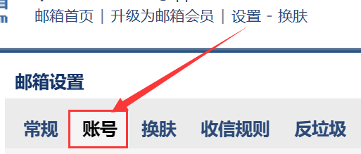
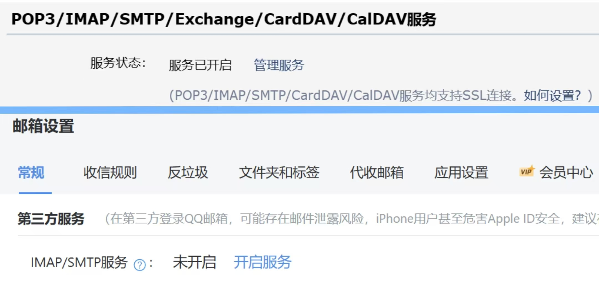

# 华师大校园小插件

华师大校园小插件旨在利用校园内已提供的服务为学生提供一个更自动化, 人性化的便利服务.

# 部署方法

## 前置配置

在项目根目录创建文件 configuration.toml 配置文件.
```javascript
ecnu-campus-plugin/
├── configuration.toml # 在此处创建
└── src/
    ├── config
    ├── ....
```

### 邮箱配置
使用一个支持 SMTP 协议的邮箱进行配置 (主流邮件服务均支持), 以下为 QQ 邮箱的配置示例.

首先进入 [QQ邮箱](https://mail.qq.com) 主页, 进入账号设置, 或进入 [新版QQ邮箱](https://wx.mail.qq.com)



若为旧版，找到开启 <u>POP3/IMAP/SMTP/Exchange/CardDAV/CalDAV</u> 服务, 点击开启.

若为新版，找到开启 <u>第三方 IMAP/SMTP</u> 服务, 点击开启.



扫描微信二维码, 按照步骤操作 (Tips: 一般是使用手机号发送 1009 至指定号码).

之后复制获得的 16 位授权码, 并粘贴至项目根目录下的 configuration.toml 中.

填写样本如下, **Notice: 发件邮箱为 user, 必须与 from 中的邮箱一致**.
```toml
[smtp]
host = "smtp.qq.com"
pass = "abcdefghijklmnop"
user = "3141592653@qq.com"
from = ["Deralive", "3141592653@qq.com"] # 发件人昵称, 邮箱
to = ["Azazo1", "2718281828@qq.com"] # 收件人昵称, 邮箱
```

## 环境准备
进入项目目录, 运行:
```shell
pip install -r requirements.txt
```
