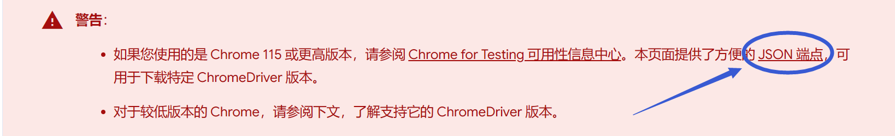

# 华师大校园小插件

华师大校园小插件旨在利用校园内已提供的服务为学生提供一个更自动化, 人性化的便利服务.

# 部署方法

## 前置配置

在项目根目录创建文件 `configuration.toml` 配置文件.
```text
ecnu-campus-plugin/
|-- configuration.toml # 在此处创建
|-- src/
    |-- config
    |--  ....
```

### 邮箱配置
使用一个支持 SMTP 协议的邮箱进行配置 (主流邮件服务均支持), 以下为 QQ 邮箱的配置示例.

首先进入 [QQ邮箱](https://mail.qq.com) 主页, 进入账号设置, 或进入 [新版QQ邮箱](https://wx.mail.qq.com)

[//]: # (![进入邮箱设置]&#40;./assets/mailbox_settings.png&#41;)


若为旧版，找到开启 <u>POP3/IMAP/SMTP/Exchange/CardDAV/CalDAV</u> 服务, 点击开启.

若为新版，找到开启 <u>第三方 IMAP/SMTP</u> 服务, 点击开启.

[//]: # (![开启 SMTP 服务]&#40;./assets/smtp_open.jpg&#41;)


扫描微信二维码, 按照步骤操作 (Tips: 一般是使用手机号发送 1009 至指定号码).

之后复制获得的 16 位授权码, 并粘贴至项目根目录下的 `configuration.toml` 中.

填写样本如下所示.
```toml
[smtp]
host = "<host_smtp_server>" # e.g. smtp.qq.com
pass = "<token>" # 上述获得的 16 位授权码
user = "<sender_email>" # e.g. 3141592653@qq.com
from = ["<sender_name>", "<sender_email>"] # 发件人昵称, 邮箱同上 e.g. ["AA", "3141592653@qq.com"]
to = ["<receiver_name>", "<receiver_email>"] # 收件人昵称, 邮箱 e.g. ["BB", "2718281828@qq.com"]
```

### WebDriver 配置

#### Edge 浏览器的部署示例
请进入 [Edge 版本](edge://version) 查看版本号(在 Edge 的地址栏输入 `edge://version` 亦可), 并下载对应版本的 [WebDriver](https://developer.microsoft.com/en-us/microsoft-edge/tools/webdriver/).

下载完成后解压, 将 msedgedriver.exe 放置在 Python 的安装目录中.

```text
Python/
|-- Scripts/
|-- Lib/
|-- mseedgedriver.exe # 在此处放置
|-- python.exe
|-- ...
```

- 若您使用的不是最新版本, 请拉至最底下进入 [Go to full directory](https://msedgewebdriverstorage.z22.web.core.windows.net/?form=MA13LH), 找到对应的版本号并下载
- 您可以在终端使用 `where python` 查看 Python 的安装目录.
- 您可以通过`Win + I`打开系统 -> 系统信息, 若<u>设备规格</u>中显示基于 x64 的处理器, 请下载 win64 版本, 若显示基于 ARM 的处理器, 请下载 arm64 版本.

#### Chrome 浏览器部署示例
请进入 [Chrome 版本](chrome://version/) 查看版本号(在 Chrome 的地址栏输入 `chrome://version` 亦可), 下载对应版本的 [WebDriver](https://developer.chrome.google.cn/docs/chromedriver/downloads?hl=zh-cn).

您可以通过网址中提及的 JSON 端点中获取您想要的版本, 复制 url 打开即可开始下载.

后续步骤与 Edge 部署示例相同.



## 环境准备
进入项目目录, 运行:
```shell
pip install -r requirements.txt
```


